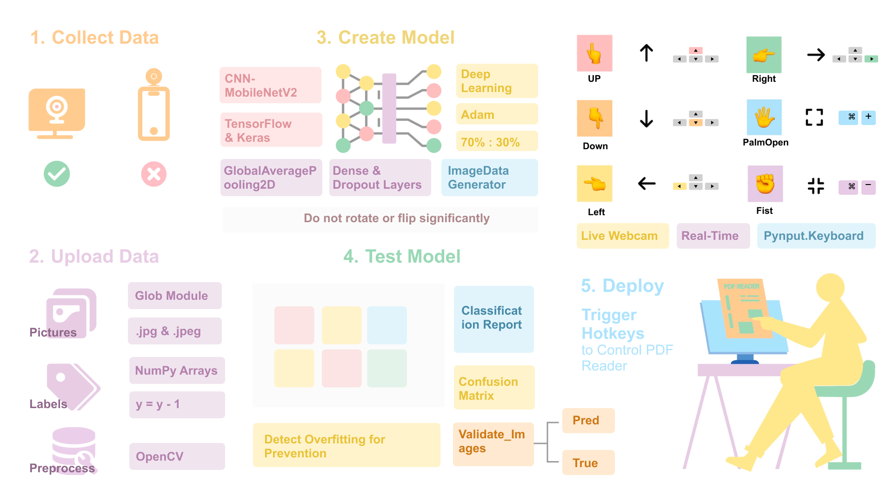
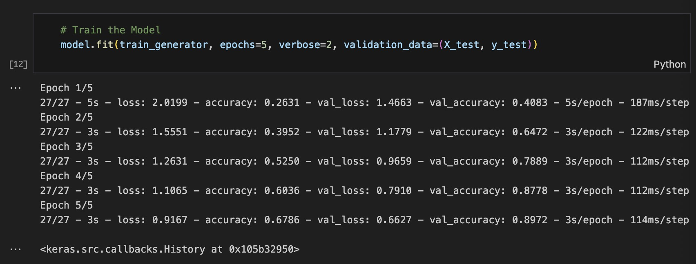
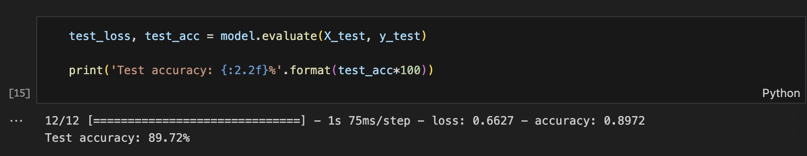
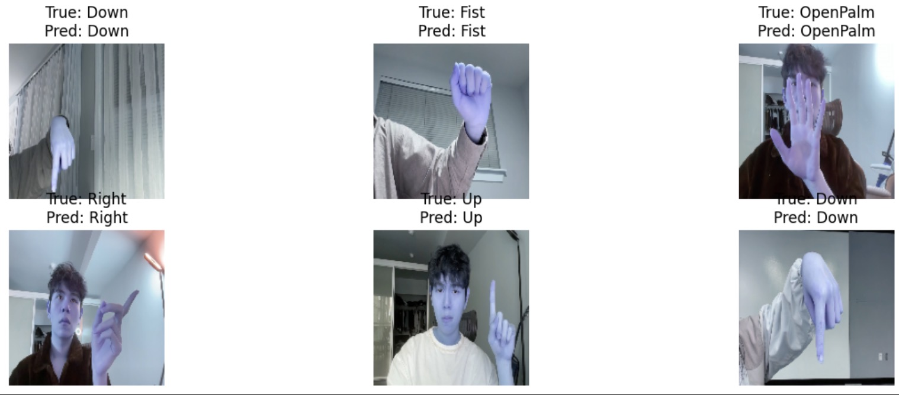
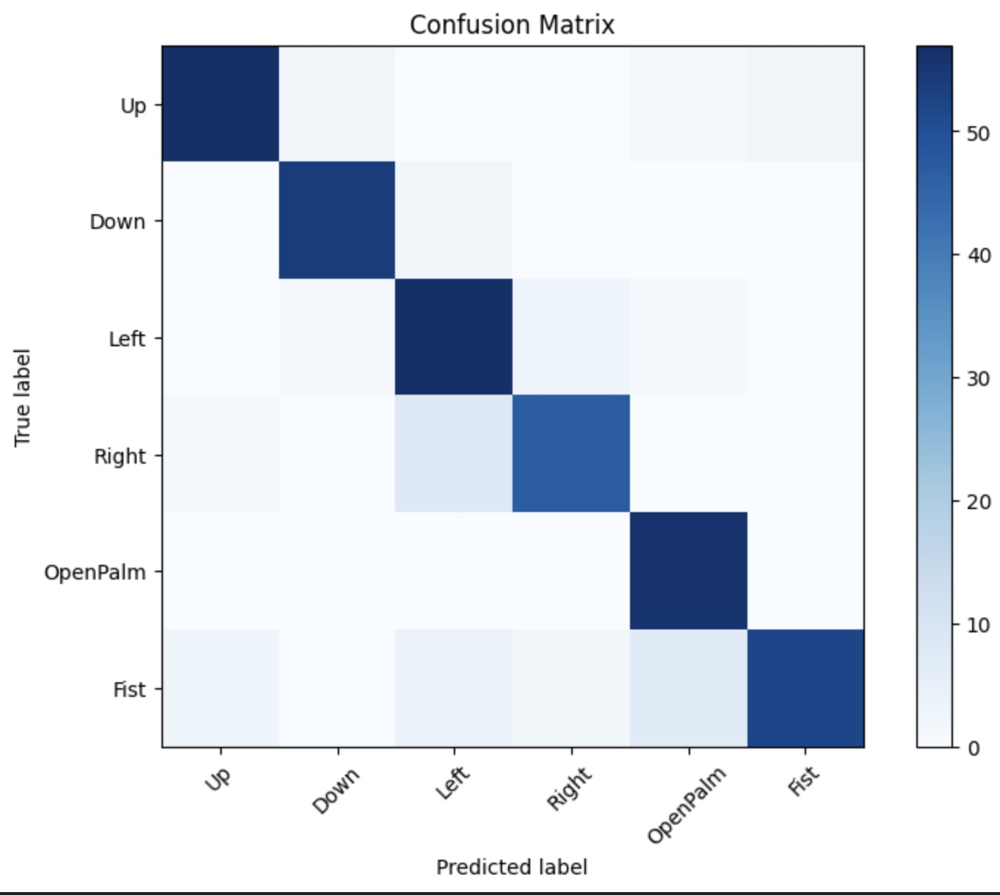
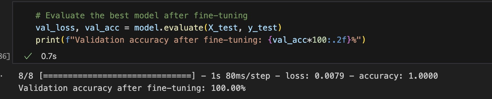
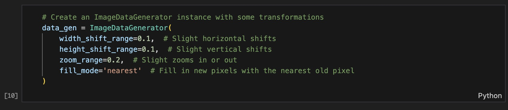

# Enhance E-Book Interaction with Intuitive Gesture-Based Controls

Flip pages with a wave. Zoom with an open palm. Fist to shrink it back down.

This project turns your webcam into a touch-free remote for reading digital books. A lightweight convolutional neural network recognizes six hand gestures in real time and maps them directly to keyboard shortcuts your e-reader already understands — no clicks, no trackpads, no touchscreens.



## The Six Gestures

| Gesture | Action |
| --- | --- |
| Up | Scroll up |
| Down | Scroll down |
| Left | Previous page |
| Right | Next page |
| Open Palm | Zoom in |
| Fist | Zoom out |

## How It Works

A webcam frame flows through a short pipeline:

1. **Capture** — OpenCV grabs frames from the live camera feed.
2. **Preprocess** — each frame is resized to 160×160 and normalized to match the training distribution.
3. **Classify** — a MobileNetV2 backbone (transfer learning, frozen base) with custom head layers predicts one of six gesture classes.
4. **Act** — `pynput` simulates the corresponding keystroke, so PDF readers and other e-book apps that respond to standard hotkeys work out of the box.

The loop runs continuously, so reading feels like reading — not like operating a gesture interface.

## Model Highlights

- **Backbone:** MobileNetV2 (ImageNet-pretrained, frozen)
- **Head:** GlobalAveragePooling → Dense (ReLU) → Dropout → Dense (softmax, 6 classes)
- **Optimizer:** Adam with exponential learning rate decay
- **Regularization:** dropout + conservative data augmentation (small shifts and zooms — deliberately *no* flips or rotations, because finger orientation is the signal)
- **Dataset:** 1,200 hand-captured images (200 per gesture), split 70/30 for train/test

## Training & Results

Training ran for five epochs. Training accuracy climbed from 26% to 68%; validation accuracy on the 30% split reached **89.72%**.



The gap between train and validation is an artifact of how they're measured, not a sign of underfitting: dropout and `ImageDataGenerator` augmentation are active during training (making the task harder) but not at validation time. The 30% split also serves as the reported test set below — it is *not* an independently held-out set.



Real frames side-by-side with predicted vs. true labels:



Per-class F1 scores range from 0.85 to 0.96. The confusion matrix shows a crisp diagonal, with two asymmetries worth noting:

- **Open Palm has perfect recall (56/56)** — but it also absorbs 7 Fist images as false positives, which is why its precision is only 0.86.
- **Right → Left confusion is the biggest cell off the diagonal** — 8 of 56 Right samples are predicted as Left, while only 3 Left samples are predicted as Right. The error is directional, not symmetric.



### Classification Report

| Gesture | Precision | Recall | F1 | Support |
| --- | --- | --- | --- | --- |
| Up | 0.93 | 0.92 | 0.93 | 62 |
| Down | 0.95 | 0.96 | 0.96 | 56 |
| Left | 0.80 | 0.92 | 0.86 | 62 |
| Right | 0.90 | 0.84 | 0.87 | 56 |
| Open Palm | 0.86 | 1.00 | 0.93 | 56 |
| Fist | 0.96 | 0.76 | 0.85 | 68 |
| **Accuracy** | | | **0.90** | 360 |

## Repository Contents

| File | Description |
| --- | --- |
| `GestureRecognition.ipynb` | End-to-end notebook: data loading, preprocessing, model building, training, evaluation, and live deployment. |
| `gesture_recognition_model.h5` | Pretrained Keras model, ready to load and run. |
| `assets/` | Figures used in this README. |

## Dataset

The raw gesture dataset (1,200 images across six classes) is hosted here:

**[Gesture_Data_2.zip — Google Drive](https://drive.google.com/file/d/1wMVTM28JdupSqk_1aDBxg5GLNCYzJocn/view?usp=sharing)**

Download it, drop it next to the notebook, and the unzipping cell will handle the rest.

## Quick Start

```bash
git clone https://github.com/wyu31/Enhance-E-Book-Interaction-with-Intuitive-Gesture-Based-Controls.git
cd Enhance-E-Book-Interaction-with-Intuitive-Gesture-Based-Controls
pip install tensorflow opencv-python numpy scikit-learn matplotlib pynput
jupyter notebook GestureRecognition.ipynb
```

Run the notebook top to bottom. The final cell opens your webcam and starts translating gestures into keystrokes — point your browser at an e-book and start reading hands-free.

## What I Learned Building This

### Fine-tuning isn't free

Unfreezing the backbone on a small dataset drove validation accuracy to a suspicious 100% — classic overfitting. Keeping MobileNetV2 frozen and leaning on dropout, augmentation, and LR decay produced a model that actually generalizes.



### Augmentation has to respect the signal

Default `ImageDataGenerator` settings (flips, big rotations) destroyed gesture direction. Small shifts and zooms only — enough to simulate real-world jitter, not enough to turn a "Left" into a "Right."



### Camera choice matters

Webcam frames beat high-res phone photos here: lower resolution keeps the hand as the subject and matches the deployment environment exactly.

### Small data details bite

Half the dataset was `.jpeg`, half was `.jpg`. Labels needed shifting from 1–6 to 0–5 for Keras. Neither bug is exciting, but both stopped the pipeline cold until fixed.

## Limitations & Next Steps

- **No independent test set.** The 30% split is used for both validation-during-training and the final reported accuracy. A truly held-out set would make the 89.72% figure more defensible.
- **Dataset size.** 200 images per gesture is a fraction of what a production-grade model needs. More samples, more lighting conditions, more hands.
- **Fist vs. directional collisions in real-time use.** During live webcam deployment, partially curled fingers in "Left" or "Right" can trigger the Fist classifier — not something the test set captured, but visible in practice. A short debounce after a directional gesture would suppress this.
- **Augmentation ceiling.** Conservative augmentation protects gesture semantics but caps how much real-world variation the model can learn. A larger, more varied dataset is the cleaner fix.

## Reference

Borba, F. (2019). *Tutorial: Using Deep Learning and CNNs to make a Hand Gesture Recognition Model.* Towards Data Science. [Link](https://towardsdatascience.com/tutorial-using-deep-learning-and-cnns-to-make-a-hand-gesture-recognition-model-371770b63a51)
